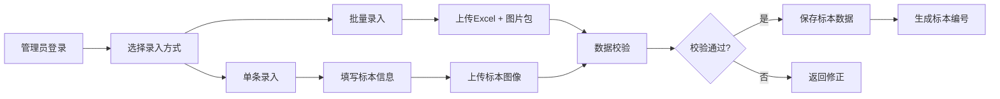
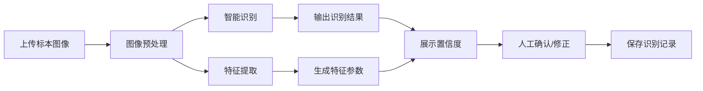

# 植物标本数字化管理与形态特征分析平台 - 产品需求文档

## 1. 产品概述

植物标本数字化管理与形态特征分析平台是一套面向植物学研究、教学及标本馆管理的全栈应用系统，致力于实现植物标本的数字化采集、智能识别、特征分析与科学管理。

- 核心价值：将传统纸质标本转化为数字资产，通过AI技术自动提取形态特征，提升标本管理效率与科研价值
- 目标用户：植物学研究人员、高校师生、标本馆管理员、自然保护机构

## 2. 核心功能

### 2.1 用户角色

| 角色 | 注册方式 | 核心权限 |
|------|----------|----------|
| 系统管理员 | 后台创建 | 用户管理、系统配置、全部数据访问 |
| 标本管理员 | 管理员审核 | 标本录入/编辑/删除、分类管理、数据导出 |
| 普通用户 | 自主注册 | 标本浏览、查询、个人收藏、分析结果查看 |

### 2.2 功能模块

1. **首页仪表盘**：标本统计概览、最近录入、快捷操作入口
2. **标本管理**：标本列表、批量录入、详情查看、编辑删除、分类筛选
3. **图像识别**：单张/批量图像上传、智能识别、识别结果确认
4. **特征分析**：形态特征参数提取、特征对比、分析报告
5. **分类管理**：科属种分类树、分类单元管理
6. **用户管理**：用户列表、角色分配、权限配置
7. **数据导出**：标本数据导出、分析报告导出

### 2.3 页面详情

| 页面名称 | 模块名称 | 功能描述 |
|----------|----------|----------|
| 登录页 | 身份认证 | 账号密码登录、记住密码、忘记密码 |
| 首页仪表盘 | 数据概览 | 标本总数、分类统计、最近录入、快捷操作 |
| 标本列表页 | 标本管理 | 分页列表、多条件筛选、搜索、批量操作 |
| 标本录入页 | 标本管理 | 单条录入、表单验证、图片上传 |
| 标本详情页 | 标本管理 | 基本信息、图像展示、特征参数、操作记录 |
| 批量录入页 | 标本管理 | Excel导入、批量上传图片、数据校验 |
| 图像识别页 | 智能识别 | 图片上传、识别结果、置信度显示、人工修正 |
| 特征分析页 | 特征提取 | 参数提取、特征对比、可视化图表 |
| 分类管理页 | 分类体系 | 分类树、分类单元增删改、层级管理 |
| 用户管理页 | 权限管理 | 用户列表、角色分配、状态管理 |
| 数据导出页 | 数据导出 | 导出格式选择、条件筛选、下载任务 |

## 3. 核心流程

### 3.1 标本数字化录入流程

管理员登录系统后，可选择单条录入或批量录入方式。单条录入需填写标本基本信息并上传图像；批量录入支持Excel模板导入与图片批量上传。系统自动进行数据校验，校验通过后存入数据库。

### 3.2 图像识别与特征提取流程

用户上传标本图像后，系统调用图像识别服务进行物种识别，同时提取叶片形状、纹理、颜色等形态特征参数。识别结果展示置信度，支持人工确认与修正。

## 4. 用户界面设计

### 4.1 设计风格

- **主色调**：自然绿系（#2E7D32），体现植物学主题，传达专业、自然、生命的品牌调性
- **辅助色**：土壤棕（#795548）、叶片浅绿（#A5D6A7）、科研蓝（#1565C0）
- **背景色**：米白色（#FAFAF5），营造舒适的研究氛围
- **按钮风格**：圆角矩形（8px），主按钮绿色渐变，悬停有微动效
- **字体**：标题使用 Lora 衬线字体（学术感），正文使用 Inter 无衬线字体（可读性）
- **布局风格**：左侧导航 + 顶部栏 + 内容区三栏布局，卡片式内容展示
- **图标风格**：线性图标，统一2px描边，自然主题元素

### 4.2 页面设计概览

| 页面名称 | 模块名称 | UI元素 |
|----------|----------|--------|
| 登录页 | 身份认证 | 左侧品牌插画、右侧登录表单、渐变背景、微动效 |
| 首页仪表盘 | 数据概览 | 统计卡片、图表区、最近录入列表、快捷操作区 |
| 标本列表页 | 标本管理 | 筛选栏、数据表格、分页器、批量操作工具栏 |
| 标本详情页 | 标本管理 | 图片画廊、信息标签页、特征参数面板、操作按钮 |
| 图像识别页 | 智能识别 | 上传区、预览图、识别结果卡片、置信度进度条 |
| 特征分析页 | 特征提取 | 参数列表、雷达图、对比选择器、导出按钮 |

### 4.3 响应式设计

- **设计策略**：桌面端优先，适配平板与移动端
- **断点设置**：1200px（桌面）、768px（平板）、480px（手机）
- **移动端适配**：左侧导航转为抽屉式，表格转为卡片列表，图表自适应缩放
- **触控优化**：按钮最小尺寸44px，手势支持滑动删除、双指缩放图片

### 4.4 视觉动效

- 页面加载：元素渐入 + 轻微上浮动画
- 卡片悬停：阴影加深 + 微位移
- 按钮交互：点击缩放反馈
- 数据更新：数字滚动动画
- 模态框：背景模糊 + 缩放进入
