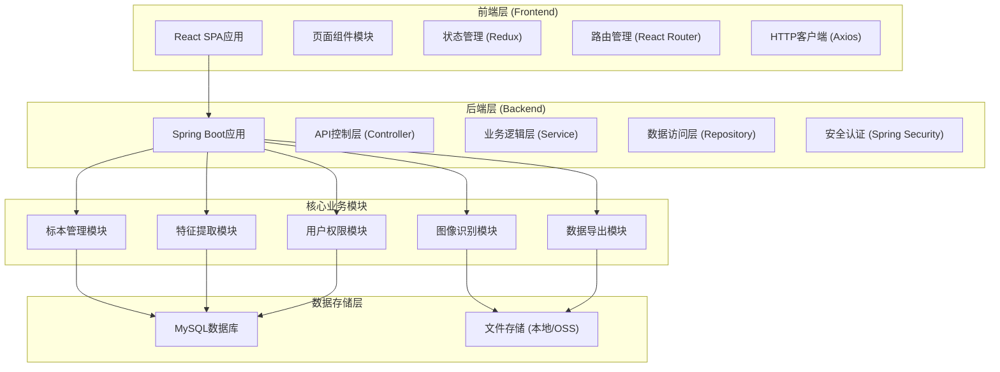
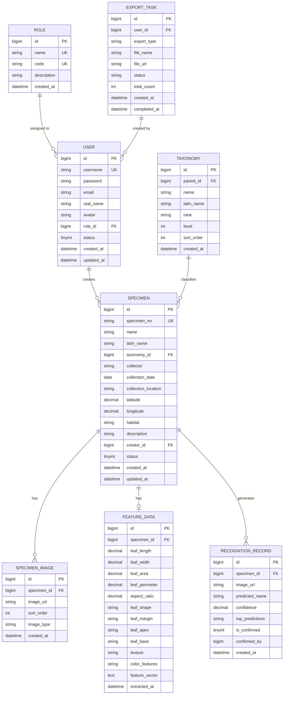
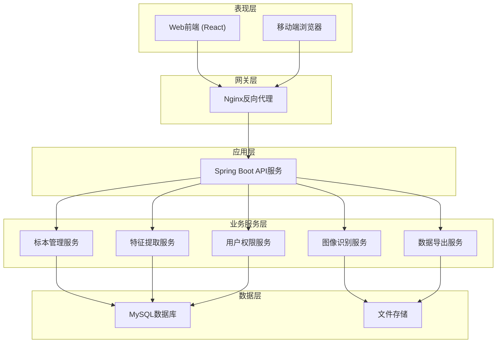

# 植物标本数字化管理与形态特征分析平台 - 技术架构文档

## 1. 总体架构设计

平台采用前后端分离的B/S架构，前端基于React构建响应式单页应用，后端基于Spring Boot提供RESTful API服务，数据存储采用MySQL关系型数据库。图像识别与特征提取作为独立服务模块，通过接口与主业务系统交互。



## 2. 技术栈说明

### 2.1 前端技术栈

| 技术 | 版本 | 用途 |
|------|------|------|
| React | 18.x | UI框架 |
| TypeScript | 5.x | 类型安全 |
| Vite | 5.x | 构建工具 |
| React Router | 6.x | 路由管理 |
| Redux Toolkit | 2.x | 状态管理 |
| Axios | 1.x | HTTP客户端 |
| Ant Design | 5.x | UI组件库 |
| ECharts | 5.x | 图表可视化 |
| TailwindCSS | 3.x | CSS工具类 |
| xlsx | 0.18.x | Excel文件处理 |

### 2.2 后端技术栈

| 技术 | 版本 | 用途 |
|------|------|------|
| Spring Boot | 3.2.x | 应用框架 |
| Spring Security | 6.x | 安全认证 |
| Spring Data JPA | 3.x | ORM框架 |
| MySQL | 8.0 | 关系型数据库 |
| JWT | 0.11.x | Token认证 |
| OpenCV | 4.9.x | 图像处理 |
| Tesseract OCR | 5.x | 文字识别 (可选) |
| Apache POI | 5.2.x | Excel处理 |
| Lombok | 1.18.x | 代码简化 |
| SpringDoc OpenAPI | 2.x | API文档 |

### 2.3 开发规范

- **代码风格**：前端遵循ESLint + Prettier规范，后端遵循Alibaba Java编码规范
- **接口规范**：RESTful风格，统一响应格式，HTTP状态码语义化
- **版本管理**：Git + GitFlow工作流
- **构建工具**：前端Vite，后端Maven

## 3. 前端工程结构

```
frontend/
├── public/                    # 静态资源
├── src/
│   ├── assets/               # 图片、字体等资源
│   ├── components/           # 公共组件
│   │   ├── layout/          # 布局组件
│   │   ├── common/          # 通用组件
│   │   └── business/        # 业务组件
│   ├── pages/               # 页面组件
│   │   ├── dashboard/       # 首页仪表盘
│   │   ├── specimen/        # 标本管理
│   │   ├── recognition/     # 图像识别
│   │   ├── analysis/        # 特征分析
│   │   ├── taxonomy/        # 分类管理
│   │   ├── user/            # 用户管理
│   │   ├── export/          # 数据导出
│   │   └── login/           # 登录页
│   ├── store/               # Redux状态管理
│   ├── router/              # 路由配置
│   ├── api/                 # API接口封装
│   ├── hooks/               # 自定义Hooks
│   ├── utils/               # 工具函数
│   ├── styles/              # 全局样式
│   ├── types/               # TypeScript类型定义
│   └── App.tsx
```

## 4. 后端工程结构

```
backend/
├── src/main/
│   ├── java/com/herbarium/
│   │   ├── HerbariumApplication.java
│   │   ├── common/           # 公共模块
│   │   │   ├── result/      # 统一响应结果
│   │   │   ├── exception/   # 异常处理
│   │   │   └── util/        # 工具类
│   │   ├── config/           # 配置类
│   │   │   ├── SecurityConfig.java
│   │   │   ├── WebConfig.java
│   │   │   └── SwaggerConfig.java
│   │   ├── modules/          # 业务模块
│   │   │   ├── specimen/    # 标本管理模块
│   │   │   │   ├── controller/
│   │   │   │   ├── service/
│   │   │   │   ├── repository/
│   │   │   │   ├── entity/
│   │   │   │   └── dto/
│   │   │   ├── recognition/ # 图像识别模块
│   │   │   │   ├── controller/
│   │   │   │   ├── service/
│   │   │   │   └── dto/
│   │   │   ├── feature/     # 特征提取模块
│   │   │   │   ├── controller/
│   │   │   │   ├── service/
│   │   │   │   └── dto/
│   │   │   ├── taxonomy/    # 分类管理模块
│   │   │   │   ├── controller/
│   │   │   │   ├── service/
│   │   │   │   ├── repository/
│   │   │   │   └── entity/
│   │   │   ├── user/        # 用户权限模块
│   │   │   │   ├── controller/
│   │   │   │   ├── service/
│   │   │   │   ├── repository/
│   │   │   │   └── entity/
│   │   │   └── export/      # 数据导出模块
│   │   │       ├── controller/
│   │   │       └── service/
│   │   └── security/         # 安全认证
│   │       ├── filter/
│   │       ├── util/
│   │       └── service/
│   └── resources/
│       ├── application.yml
│       └── mapper/
```

## 5. 路由定义

| 路由路径 | 页面名称 | 权限要求 |
|----------|----------|----------|
| /login | 登录页 | 公开 |
| /dashboard | 首页仪表盘 | 登录用户 |
| /specimen | 标本列表 | 登录用户 |
| /specimen/new | 新增标本 | 标本管理员+ |
| /specimen/:id | 标本详情 | 登录用户 |
| /specimen/batch | 批量录入 | 标本管理员+ |
| /recognition | 图像识别 | 登录用户 |
| /analysis | 特征分析 | 登录用户 |
| /taxonomy | 分类管理 | 标本管理员+ |
| /user | 用户管理 | 系统管理员 |
| /export | 数据导出 | 标本管理员+ |

## 6. API接口定义

### 6.1 统一响应格式

```json
{
  "code": 200,
  "message": "操作成功",
  "data": {}
}
```

### 6.2 认证相关API

| 方法 | 路径 | 说明 | 请求体 | 响应体 |
|------|------|------|--------|--------|
| POST | /api/auth/login | 用户登录 | {username, password} | {token, userInfo} |
| POST | /api/auth/logout | 用户登出 | - | - |
| GET | /api/auth/userinfo | 获取当前用户信息 | - | 用户信息对象 |

### 6.3 标本管理API

| 方法 | 路径 | 说明 |
|------|------|------|
| GET | /api/specimens | 分页查询标本列表 |
| GET | /api/specimens/{id} | 获取标本详情 |
| POST | /api/specimens | 新增标本 |
| PUT | /api/specimens/{id} | 更新标本信息 |
| DELETE | /api/specimens/{id} | 删除标本 |
| POST | /api/specimens/batch | 批量导入标本 |
| POST | /api/specimens/{id}/image | 上传标本图片 |

### 6.4 图像识别API

| 方法 | 路径 | 说明 |
|------|------|------|
| POST | /api/recognition/identify | 单张图像识别 |
| POST | /api/recognition/batch | 批量图像识别 |
| GET | /api/recognition/history | 识别历史记录 |
| POST | /api/recognition/{id}/confirm | 确认识别结果 |

### 6.5 特征提取API

| 方法 | 路径 | 说明 |
|------|------|------|
| POST | /api/feature/extract | 提取形态特征 |
| GET | /api/feature/{specimenId} | 获取标本特征参数 |
| POST | /api/feature/compare | 多标本特征对比 |

### 6.6 分类管理API

| 方法 | 路径 | 说明 |
|------|------|------|
| GET | /api/taxonomy/tree | 获取分类树 |
| GET | /api/taxonomy/{id}/children | 获取子分类 |
| POST | /api/taxonomy | 新增分类单元 |
| PUT | /api/taxonomy/{id} | 更新分类单元 |
| DELETE | /api/taxonomy/{id} | 删除分类单元 |

### 6.7 用户管理API

| 方法 | 路径 | 说明 |
|------|------|------|
| GET | /api/users | 分页查询用户列表 |
| GET | /api/users/{id} | 获取用户详情 |
| POST | /api/users | 新增用户 |
| PUT | /api/users/{id} | 更新用户信息 |
| PUT | /api/users/{id}/role | 分配用户角色 |
| DELETE | /api/users/{id} | 删除用户 |

### 6.8 数据导出API

| 方法 | 路径 | 说明 |
|------|------|------|
| POST | /api/export/specimens | 导出门本数据 |
| GET | /api/export/{taskId}/status | 查询导出任务状态 |
| GET | /api/export/{taskId}/download | 下载导出文件 |

## 7. 数据模型

### 7.1 ER图



### 7.2 核心表DDL

```sql
-- 用户表
CREATE TABLE `user` (
  `id` BIGINT NOT NULL AUTO_INCREMENT,
  `username` VARCHAR(50) NOT NULL COMMENT '用户名',
  `password` VARCHAR(100) NOT NULL COMMENT '密码',
  `email` VARCHAR(100) DEFAULT NULL COMMENT '邮箱',
  `real_name` VARCHAR(50) DEFAULT NULL COMMENT '真实姓名',
  `avatar` VARCHAR(255) DEFAULT NULL COMMENT '头像',
  `role_id` BIGINT NOT NULL COMMENT '角色ID',
  `status` TINYINT DEFAULT 1 COMMENT '状态 1正常 0禁用',
  `created_at` DATETIME DEFAULT CURRENT_TIMESTAMP,
  `updated_at` DATETIME DEFAULT CURRENT_TIMESTAMP ON UPDATE CURRENT_TIMESTAMP,
  PRIMARY KEY (`id`),
  UNIQUE KEY `uk_username` (`username`)
) ENGINE=InnoDB DEFAULT CHARSET=utf8mb4 COMMENT='用户表';

-- 角色表
CREATE TABLE `role` (
  `id` BIGINT NOT NULL AUTO_INCREMENT,
  `name` VARCHAR(50) NOT NULL COMMENT '角色名称',
  `code` VARCHAR(50) NOT NULL COMMENT '角色编码',
  `description` VARCHAR(255) DEFAULT NULL COMMENT '角色描述',
  `created_at` DATETIME DEFAULT CURRENT_TIMESTAMP,
  PRIMARY KEY (`id`),
  UNIQUE KEY `uk_code` (`code`)
) ENGINE=InnoDB DEFAULT CHARSET=utf8mb4 COMMENT='角色表';

-- 分类表
CREATE TABLE `taxonomy` (
  `id` BIGINT NOT NULL AUTO_INCREMENT,
  `parent_id` BIGINT DEFAULT 0 COMMENT '父分类ID',
  `name` VARCHAR(100) NOT NULL COMMENT '中文名称',
  `latin_name` VARCHAR(150) DEFAULT NULL COMMENT '拉丁名',
  `rank` VARCHAR(20) NOT NULL COMMENT '分类等级 kingdom/phylum/class/order/family/genus/species',
  `level` INT NOT NULL COMMENT '层级',
  `sort_order` INT DEFAULT 0 COMMENT '排序',
  `created_at` DATETIME DEFAULT CURRENT_TIMESTAMP,
  PRIMARY KEY (`id`),
  KEY `idx_parent_id` (`parent_id`)
) ENGINE=InnoDB DEFAULT CHARSET=utf8mb4 COMMENT='植物分类表';

-- 标本表
CREATE TABLE `specimen` (
  `id` BIGINT NOT NULL AUTO_INCREMENT,
  `specimen_no` VARCHAR(50) NOT NULL COMMENT '标本编号',
  `name` VARCHAR(100) NOT NULL COMMENT '中文名',
  `latin_name` VARCHAR(150) DEFAULT NULL COMMENT '拉丁名',
  `taxonomy_id` BIGINT DEFAULT NULL COMMENT '分类ID',
  `collector` VARCHAR(100) DEFAULT NULL COMMENT '采集人',
  `collection_date` DATE DEFAULT NULL COMMENT '采集日期',
  `collection_location` VARCHAR(255) DEFAULT NULL COMMENT '采集地点',
  `latitude` DECIMAL(10,7) DEFAULT NULL COMMENT '纬度',
  `longitude` DECIMAL(10,7) DEFAULT NULL COMMENT '经度',
  `habitat` VARCHAR(255) DEFAULT NULL COMMENT '生境',
  `description` TEXT COMMENT '描述',
  `creator_id` BIGINT NOT NULL COMMENT '创建人ID',
  `status` TINYINT DEFAULT 1 COMMENT '状态',
  `created_at` DATETIME DEFAULT CURRENT_TIMESTAMP,
  `updated_at` DATETIME DEFAULT CURRENT_TIMESTAMP ON UPDATE CURRENT_TIMESTAMP,
  PRIMARY KEY (`id`),
  UNIQUE KEY `uk_specimen_no` (`specimen_no`),
  KEY `idx_taxonomy_id` (`taxonomy_id`),
  KEY `idx_creator_id` (`creator_id`)
) ENGINE=InnoDB DEFAULT CHARSET=utf8mb4 COMMENT='植物标本表';

-- 标本图片表
CREATE TABLE `specimen_image` (
  `id` BIGINT NOT NULL AUTO_INCREMENT,
  `specimen_id` BIGINT NOT NULL COMMENT '标本ID',
  `image_url` VARCHAR(255) NOT NULL COMMENT '图片地址',
  `sort_order` INT DEFAULT 0 COMMENT '排序',
  `image_type` VARCHAR(20) DEFAULT 'specimen' COMMENT '图片类型',
  `created_at` DATETIME DEFAULT CURRENT_TIMESTAMP,
  PRIMARY KEY (`id`),
  KEY `idx_specimen_id` (`specimen_id`)
) ENGINE=InnoDB DEFAULT CHARSET=utf8mb4 COMMENT='标本图片表';

-- 特征数据表
CREATE TABLE `feature_data` (
  `id` BIGINT NOT NULL AUTO_INCREMENT,
  `specimen_id` BIGINT NOT NULL COMMENT '标本ID',
  `leaf_length` DECIMAL(10,2) DEFAULT NULL COMMENT '叶片长度(mm)',
  `leaf_width` DECIMAL(10,2) DEFAULT NULL COMMENT '叶片宽度(mm)',
  `leaf_area` DECIMAL(10,2) DEFAULT NULL COMMENT '叶片面积(mm²)',
  `leaf_perimeter` DECIMAL(10,2) DEFAULT NULL COMMENT '叶片周长(mm)',
  `aspect_ratio` DECIMAL(5,2) DEFAULT NULL COMMENT '长宽比',
  `leaf_shape` VARCHAR(50) DEFAULT NULL COMMENT '叶形',
  `leaf_margin` VARCHAR(50) DEFAULT NULL COMMENT '叶缘',
  `leaf_apex` VARCHAR(50) DEFAULT NULL COMMENT '叶端',
  `leaf_base` VARCHAR(50) DEFAULT NULL COMMENT '叶基',
  `texture` VARCHAR(50) DEFAULT NULL COMMENT '质地',
  `color_features` TEXT COMMENT '颜色特征JSON',
  `feature_vector` TEXT COMMENT '特征向量JSON',
  `extracted_at` DATETIME DEFAULT NULL COMMENT '提取时间',
  PRIMARY KEY (`id`),
  UNIQUE KEY `uk_specimen_id` (`specimen_id`)
) ENGINE=InnoDB DEFAULT CHARSET=utf8mb4 COMMENT='形态特征数据表';

-- 识别记录表
CREATE TABLE `recognition_record` (
  `id` BIGINT NOT NULL AUTO_INCREMENT,
  `specimen_id` BIGINT DEFAULT NULL COMMENT '标本ID',
  `image_url` VARCHAR(255) NOT NULL COMMENT '识别图片',
  `predicted_name` VARCHAR(100) DEFAULT NULL COMMENT '预测名称',
  `confidence` DECIMAL(5,4) DEFAULT NULL COMMENT '置信度',
  `top_predictions` TEXT COMMENT 'TopN预测结果JSON',
  `is_confirmed` TINYINT DEFAULT 0 COMMENT '是否确认 0未确认 1已确认',
  `confirmed_by` BIGINT DEFAULT NULL COMMENT '确认人',
  `created_at` DATETIME DEFAULT CURRENT_TIMESTAMP,
  PRIMARY KEY (`id`),
  KEY `idx_specimen_id` (`specimen_id`)
) ENGINE=InnoDB DEFAULT CHARSET=utf8mb4 COMMENT='图像识别记录表';

-- 导出任务表
CREATE TABLE `export_task` (
  `id` BIGINT NOT NULL AUTO_INCREMENT,
  `user_id` BIGINT NOT NULL COMMENT '创建用户ID',
  `export_type` VARCHAR(50) NOT NULL COMMENT '导出类型',
  `file_name` VARCHAR(255) DEFAULT NULL COMMENT '文件名',
  `file_url` VARCHAR(255) DEFAULT NULL COMMENT '文件地址',
  `status` VARCHAR(20) DEFAULT 'pending' COMMENT '状态 pending/processing/completed/failed',
  `total_count` INT DEFAULT 0 COMMENT '总记录数',
  `created_at` DATETIME DEFAULT CURRENT_TIMESTAMP,
  `completed_at` DATETIME DEFAULT NULL COMMENT '完成时间',
  PRIMARY KEY (`id`),
  KEY `idx_user_id` (`user_id`)
) ENGINE=InnoDB DEFAULT CHARSET=utf8mb4 COMMENT='数据导出任务表';
```

## 8. 核心技术方案

### 8.1 认证授权方案

- 采用JWT Token进行无状态身份认证
- Spring Security实现细粒度权限控制
- 基于角色的访问控制（RBAC）
- Token过期自动刷新机制

### 8.2 图像识别方案

- 基于预训练的深度学习模型进行植物识别
- OpenCV进行图像预处理（去噪、增强、分割）
- 支持叶片、花朵等不同部位的识别
- 识别结果置信度评估与Top-N展示

### 8.3 特征提取方案

- 几何特征：长度、宽度、面积、周长、长宽比、圆形度等
- 形状特征：傅里叶描述子、Hu不变矩
- 颜色特征：颜色直方图、颜色矩
- 纹理特征：灰度共生矩阵、LBP特征
- 特征数据向量化存储，支持相似性检索

### 8.4 文件存储方案

- 支持本地文件系统存储和阿里云OSS两种模式
- 图片压缩与多尺寸缩略图生成
- 文件上传进度与断点续传（大文件）

## 9. 服务架构


